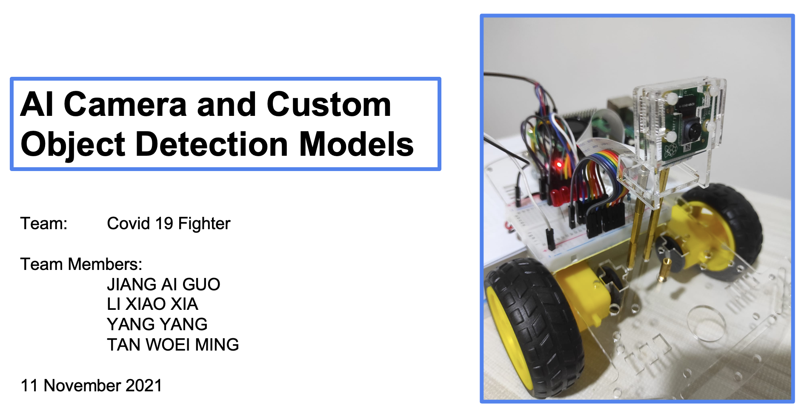

## SECTION 1 : PROJECT TITLE
## AI Camera and Custom Object Detection Models

---

## SECTION 2 : EXECUTIVE SUMMARY 

This project study YOLO, SDD and R-CNN object detection models for person social distance. The model is compared in Node JS web and implemented in Raspberry Pi.

---

## SECTION 3 : CREDITS / PROJECT CONTRIBUTION

| Name          | Student ID| Email              |
| ------------- |-----------| -------------------|
| LI XIAO XIA   | A0229975J | E0687383@u.nus.edu |
| YANG YANG     | A0229971R | E0687379@u.nus.edu |
| TAN WOEI MING | A0229974L | E0687382@u.nus.edu |
| JIANG AI GUO  | A0180524L | E0284010@u.nus.edu |
| ANG JENN NING | A0229970U | E0687378@u.nus.edu |

---
## SECTION 4 : VIDEO OF SYSTEM MODELLING & USE CASE DEMO

AI Camera and Custom Object Detection Models
- Social Distance Persons Detection
- Node JS Web Application
- Raspberry Pi Implementation

---
